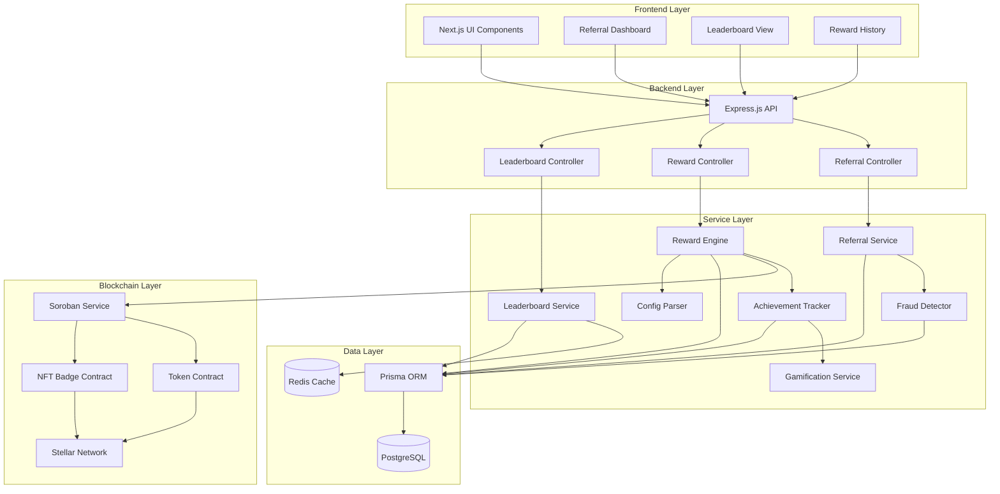
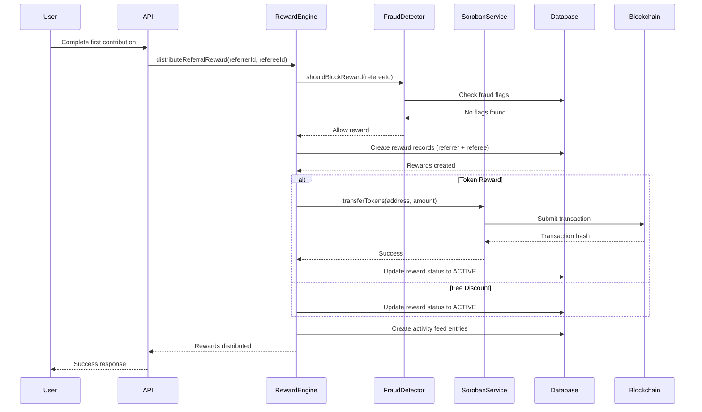
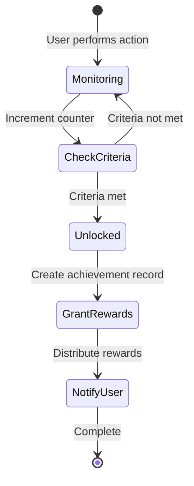

# Design Document: Referral and Rewards Program

## Overview

The Referral and Rewards Program extends the existing Ajo gamification system to incentivize user growth through referral tracking, multi-type rewards, achievements, and competitive leaderboards. This design integrates seamlessly with the current PostgreSQL/Prisma database, Express.js backend, Next.js frontend, and Stellar/Soroban blockchain infrastructure.

### Key Design Goals

1. **Leverage Existing Infrastructure**: Build upon the current UserGamification, Achievement, and Challenge models
2. **Blockchain Integration**: Utilize Soroban smart contracts for token rewards and NFT badge minting
3. **Fraud Prevention**: Implement robust detection mechanisms to prevent referral abuse
4. **Scalability**: Design for high-volume referral tracking and reward distribution
5. **Configurability**: Enable administrators to adjust reward parameters without code changes

### System Context

The referral system operates within the Ajo decentralized savings platform, where users:
- Create and join savings groups
- Make periodic contributions
- Receive payouts based on group cycles
- Earn achievements and points through the gamification system

The referral program adds a growth layer by rewarding users who invite others and maintain active participation.

## Architecture

### High-Level Architecture



### Service Responsibilities

#### Referral Service
- Generate unique referral codes using cryptographically secure random generation
- Track referral relationships with timestamp and metadata
- Validate referral codes before creating relationships
- Provide referral statistics and analytics

#### Reward Engine
- Calculate reward eligibility based on user actions and configuration
- Distribute multiple reward types (discounts, tokens, features, NFTs)
- Coordinate with blockchain services for on-chain rewards
- Manage reward lifecycle (pending, active, redeemed, expired)
- Parse and apply reward configuration files

#### Achievement Tracker
- Monitor user actions for achievement criteria
- Unlock achievements when criteria are met
- Trigger reward distribution for achievement unlocks
- Integrate with existing gamification system

#### Leaderboard Service
- Maintain real-time rankings for multiple leaderboard types
- Cache leaderboard data in Redis for performance
- Update rankings on relevant user actions
- Support pagination and filtering

#### Fraud Detector
- Analyze referral patterns for suspicious activity
- Check IP addresses and device fingerprints
- Flag self-referrals and bulk account creation
- Prevent reward distribution for flagged referrals

#### Config Parser
- Parse YAML/JSON reward configuration files
- Validate configuration schema
- Serialize configuration objects back to files
- Support hot-reloading of configuration changes

## Components and Interfaces

### Database Schema Extensions

The design extends the existing Prisma schema with new models:

```prisma
model Referral {
  id            String   @id @default(cuid())
  referrerId    String   // User who invited
  refereeId     String   // User who was invited
  referralCode  String
  status        String   @default("PENDING") // PENDING, ACTIVE, COMPLETED, FLAGGED
  createdAt     DateTime @default(now())
  completedAt   DateTime? // When referee completed first contribution
  
  referrer User @relation("ReferralsGiven", fields: [referrerId], references: [walletAddress], onDelete: Cascade)
  referee  User @relation("ReferralsReceived", fields: [refereeId], references: [walletAddress], onDelete: Cascade)
  
  @@unique([refereeId]) // Each user can only be referred once
  @@index([referrerId])
  @@index([referralCode])
  @@index([status])
}

model ReferralCode {
  id        String   @id @default(cuid())
  userId    String   @unique
  code      String   @unique
  createdAt DateTime @default(now())
  
  user User @relation("UserReferralCode", fields: [userId], references: [walletAddress], onDelete: Cascade)
  
  @@index([code])
}

model Reward {
  id            String    @id @default(cuid())
  userId        String
  type          String    // FEE_DISCOUNT, BONUS_TOKEN, PREMIUM_FEATURE, NFT_BADGE
  status        String    @default("PENDING") // PENDING, ACTIVE, REDEEMED, EXPIRED, FAILED
  source        String    // REFERRAL, ACHIEVEMENT, CHALLENGE
  sourceId      String?   // Achievement ID, Challenge ID, etc.
  
  // Type-specific fields
  discountPercent Int?
  tokenAmount     BigInt?
  featureId       String?
  nftMetadata     String?   @db.Text
  
  // Blockchain fields
  txHash          String?
  nftTokenId      String?
  
  // Lifecycle fields
  earnedAt        DateTime  @default(now())
  expiresAt       DateTime?
  redeemedAt      DateTime?
  
  metadata        String?   @db.Text // JSON for additional data
  
  user User @relation("UserRewards", fields: [userId], references: [walletAddress], onDelete: Cascade)
  
  @@index([userId, status])
  @@index([type])
  @@index([source, sourceId])
  @@index([expiresAt])
}

model FraudFlag {
  id          String   @id @default(cuid())
  referralId  String?
  userId      String?
  flagType    String   // SELF_REFERRAL, IP_MATCH, DEVICE_MATCH, BULK_CREATION
  severity    String   // LOW, MEDIUM, HIGH
  details     String   @db.Text // JSON with evidence
  status      String   @default("PENDING") // PENDING, REVIEWED, CONFIRMED, DISMISSED
  createdAt   DateTime @default(now())
  reviewedAt  DateTime?
  reviewedBy  String?
  
  referral Referral? @relation(fields: [referralId], references: [id], onDelete: Cascade)
  user     User?     @relation("UserFraudFlags", fields: [userId], references: [walletAddress], onDelete: Cascade)
  
  @@index([referralId])
  @@index([userId])
  @@index([status])
  @@index([severity])
}

model LeaderboardCache {
  id            String   @id @default(cuid())
  leaderboardType String // TOP_REFERRERS, MOST_ACTIVE, BEST_SAVERS
  period        String   // ALL_TIME, MONTHLY, WEEKLY
  rank          Int
  userId        String
  score         BigInt   // Referral count, contribution count, or total saved
  metadata      String?  @db.Text // JSON for additional display data
  updatedAt     DateTime @default(now())
  
  user User @relation("LeaderboardEntries", fields: [userId], references: [walletAddress], onDelete: Cascade)
  
  @@unique([leaderboardType, period, userId])
  @@index([leaderboardType, period, rank])
  @@index([updatedAt])
}

model RewardConfig {
  id          String   @id @default(cuid())
  name        String   @unique
  version     Int      @default(1)
  config      String   @db.Text // JSON configuration
  isActive    Boolean  @default(false)
  createdAt   DateTime @default(now())
  activatedAt DateTime?
  
  @@index([isActive])
}

// Extend User model with relations
model User {
  // ... existing fields ...
  
  referralCode      ReferralCode?     @relation("UserReferralCode")
  referralsGiven    Referral[]        @relation("ReferralsGiven")
  referralsReceived Referral?         @relation("ReferralsReceived")
  rewards           Reward[]          @relation("UserRewards")
  fraudFlags        FraudFlag[]       @relation("UserFraudFlags")
  leaderboardEntries LeaderboardCache[] @relation("LeaderboardEntries")
}
```

### API Endpoints

#### Referral Endpoints

```typescript
// POST /api/referrals/generate
// Generate or retrieve referral code for authenticated user
interface GenerateReferralCodeRequest {}
interface GenerateReferralCodeResponse {
  code: string;
  shareUrl: string;
  totalReferrals: number;
}

// POST /api/referrals/validate
// Validate a referral code before registration
interface ValidateReferralCodeRequest {
  code: string;
}
interface ValidateReferralCodeResponse {
  valid: boolean;
  referrerUsername?: string;
}

// GET /api/referrals/stats
// Get referral statistics for authenticated user
interface ReferralStatsResponse {
  totalReferrals: number;
  activeReferrals: number;
  pendingReferrals: number;
  totalRewardsEarned: number;
  referrals: Array<{
    refereeId: string;
    refereeUsername: string;
    status: string;
    joinedAt: string;
    completedAt?: string;
  }>;
}
```

#### Reward Endpoints

```typescript
// GET /api/rewards
// Get all rewards for authenticated user
interface GetRewardsRequest {
  status?: 'PENDING' | 'ACTIVE' | 'REDEEMED' | 'EXPIRED';
  type?: 'FEE_DISCOUNT' | 'BONUS_TOKEN' | 'PREMIUM_FEATURE' | 'NFT_BADGE';
}
interface GetRewardsResponse {
  rewards: Array<{
    id: string;
    type: string;
    status: string;
    earnedAt: string;
    expiresAt?: string;
    details: any;
  }>;
}

// POST /api/rewards/:id/redeem
// Redeem a specific reward
interface RedeemRewardRequest {}
interface RedeemRewardResponse {
  success: boolean;
  reward: {
    id: string;
    type: string;
    redeemedAt: string;
  };
}

// GET /api/rewards/history
// Get complete reward history
interface RewardHistoryResponse {
  history: Array<{
    id: string;
    type: string;
    status: string;
    source: string;
    earnedAt: string;
    redeemedAt?: string;
    expiresAt?: string;
  }>;
  totalEarned: number;
  totalRedeemed: number;
}
```

#### Leaderboard Endpoints

```typescript
// GET /api/leaderboards/referrers
// Get top referrers leaderboard
interface GetLeaderboardRequest {
  period?: 'ALL_TIME' | 'MONTHLY' | 'WEEKLY';
  limit?: number;
  offset?: number;
}
interface LeaderboardResponse {
  leaderboard: Array<{
    rank: number;
    userId: string;
    username: string;
    score: number;
    metadata?: any;
  }>;
  userRank?: number;
  total: number;
}

// GET /api/leaderboards/active
// Get most active users leaderboard

// GET /api/leaderboards/savers
// Get best savers leaderboard
```

### Service Interfaces

#### ReferralService Interface

```typescript
interface IReferralService {
  // Code generation
  generateReferralCode(userId: string): Promise<string>;
  getReferralCode(userId: string): Promise<string | null>;
  
  // Validation
  validateReferralCode(code: string): Promise<boolean>;
  getReferrerByCode(code: string): Promise<string | null>;
  
  // Relationship tracking
  createReferral(referrerId: string, refereeId: string, code: string): Promise<Referral>;
  completeReferral(refereeId: string): Promise<void>;
  
  // Statistics
  getReferralStats(userId: string): Promise<ReferralStats>;
  getReferralCount(userId: string, status?: string): Promise<number>;
}
```

#### RewardEngine Interface

```typescript
interface IRewardEngine {
  // Reward distribution
  distributeReferralReward(referrerId: string, refereeId: string): Promise<void>;
  distributeAchievementReward(userId: string, achievementId: string): Promise<void>;
  
  // Reward types
  grantFeeDiscount(userId: string, percent: number, expiresAt: Date): Promise<Reward>;
  grantBonusTokens(userId: string, amount: bigint): Promise<Reward>;
  grantPremiumFeature(userId: string, featureId: string, expiresAt: Date): Promise<Reward>;
  mintNFTBadge(userId: string, metadata: NFTMetadata): Promise<Reward>;
  
  // Reward management
  getActiveRewards(userId: string, type?: string): Promise<Reward[]>;
  redeemReward(rewardId: string): Promise<void>;
  expireRewards(): Promise<void>;
  
  // Configuration
  loadConfiguration(config: RewardConfiguration): Promise<void>;
  getConfiguration(): Promise<RewardConfiguration>;
}
```

#### FraudDetector Interface

```typescript
interface IFraudDetector {
  // Detection
  checkReferral(referrerId: string, refereeId: string, metadata: ReferralMetadata): Promise<FraudCheckResult>;
  checkSelfReferral(referrerId: string, refereeId: string): Promise<boolean>;
  checkIPMatch(referrerId: string, refereeId: string): Promise<boolean>;
  checkDeviceMatch(referrerId: string, refereeId: string): Promise<boolean>;
  checkBulkCreation(ipAddress: string): Promise<boolean>;
  
  // Flagging
  flagReferral(referralId: string, flagType: string, details: any): Promise<FraudFlag>;
  reviewFlag(flagId: string, status: string, reviewerId: string): Promise<void>;
  
  // Prevention
  shouldBlockReward(userId: string): Promise<boolean>;
}
```

## Data Models

### Core Domain Models

#### Referral Model

```typescript
interface Referral {
  id: string;
  referrerId: string;
  refereeId: string;
  referralCode: string;
  status: 'PENDING' | 'ACTIVE' | 'COMPLETED' | 'FLAGGED';
  createdAt: Date;
  completedAt?: Date;
}
```

**State Transitions:**
- PENDING → ACTIVE: When referee completes account setup
- ACTIVE → COMPLETED: When referee completes first contribution
- Any → FLAGGED: When fraud is detected

#### Reward Model

```typescript
interface Reward {
  id: string;
  userId: string;
  type: 'FEE_DISCOUNT' | 'BONUS_TOKEN' | 'PREMIUM_FEATURE' | 'NFT_BADGE';
  status: 'PENDING' | 'ACTIVE' | 'REDEEMED' | 'EXPIRED' | 'FAILED';
  source: 'REFERRAL' | 'ACHIEVEMENT' | 'CHALLENGE';
  sourceId?: string;
  
  // Type-specific fields
  discountPercent?: number;
  tokenAmount?: bigint;
  featureId?: string;
  nftMetadata?: NFTMetadata;
  
  // Blockchain fields
  txHash?: string;
  nftTokenId?: string;
  
  // Lifecycle
  earnedAt: Date;
  expiresAt?: Date;
  redeemedAt?: Date;
  
  metadata?: Record<string, any>;
}
```

**State Transitions:**
- PENDING → ACTIVE: When blockchain transaction confirms (for tokens/NFTs) or immediately (for discounts/features)
- PENDING → FAILED: When blockchain transaction fails after retries
- ACTIVE → REDEEMED: When user claims the reward
- ACTIVE → EXPIRED: When expiration date passes

#### RewardConfiguration Model

```typescript
interface RewardConfiguration {
  version: number;
  referralRewards: {
    referrer: RewardDefinition[];
    referee: RewardDefinition[];
  };
  achievements: {
    [achievementId: string]: {
      name: string;
      description: string;
      criteria: AchievementCriteria;
      rewards: RewardDefinition[];
    };
  };
  features: {
    [featureId: string]: {
      name: string;
      description: string;
    };
  };
}

interface RewardDefinition {
  type: 'FEE_DISCOUNT' | 'BONUS_TOKEN' | 'PREMIUM_FEATURE' | 'NFT_BADGE';
  amount?: number | bigint;
  featureId?: string;
  nftMetadata?: NFTMetadata;
  expirationDays?: number;
}

interface AchievementCriteria {
  type: 'FIRST_GROUP' | 'CONTRIBUTION_COUNT' | 'PERFECT_ATTENDANCE' | 'REFERRAL_COUNT';
  threshold?: number;
  consecutiveRequired?: boolean;
}
```

### Blockchain Integration Models

#### NFT Badge Metadata

```typescript
interface NFTMetadata {
  name: string;
  description: string;
  image: string; // IPFS URL
  attributes: Array<{
    trait_type: string;
    value: string | number;
  }>;
  achievement: string;
  earnedDate: string;
}
```

#### Token Transfer

```typescript
interface TokenTransfer {
  recipientAddress: string;
  amount: bigint;
  memo?: string;
}
```

### Fraud Detection Models

#### ReferralMetadata

```typescript
interface ReferralMetadata {
  ipAddress: string;
  userAgent: string;
  deviceFingerprint?: string;
  registrationTimestamp: Date;
}
```

#### FraudCheckResult

```typescript
interface FraudCheckResult {
  passed: boolean;
  flags: Array<{
    type: string;
    severity: 'LOW' | 'MEDIUM' | 'HIGH';
    details: any;
  }>;
  shouldBlock: boolean;
}
```


## Correctness Properties

*A property is a characteristic or behavior that should hold true across all valid executions of a system—essentially, a formal statement about what the system should do. Properties serve as the bridge between human-readable specifications and machine-verifiable correctness guarantees.*

### Property 1: Referral Code Generation

*For any* user account creation, a unique alphanumeric referral code between 6 and 12 characters in length should be generated and stored, and no two users should ever receive identical codes.

**Validates: Requirements 1.1, 1.2, 1.3**

### Property 2: Referral Relationship Recording

*For any* new user registration with a valid referral code, the system should create a referral relationship record with a timestamp, and the referrer's total referral count should increment by exactly one.

**Validates: Requirements 2.1, 2.2, 2.3**

### Property 3: Referral Code Validation

*For any* referral code that does not exist in the system, attempting to create a referral relationship should be rejected with a descriptive error message.

**Validates: Requirements 2.4, 2.5**

### Property 4: Dual Referral Rewards

*For any* referee completing their first contribution, the system should grant rewards to both the referrer and the referee, and both reward records should be created in the reward history.

**Validates: Requirements 3.1, 3.3, 3.4**

### Property 5: Fee Discount Storage

*For any* fee discount reward earned by a user, the reward record should contain both a discount percentage and an expiration date.

**Validates: Requirements 4.1**

### Property 6: Maximum Discount Application

*For any* user with multiple active fee discount rewards, when making a contribution, the system should apply the discount with the highest percentage value to the transaction fee.

**Validates: Requirements 4.2**

### Property 7: Discount Calculation

*For any* contribution with an applicable fee discount, the final fee should equal the original fee multiplied by (1 - discount_percentage / 100).

**Validates: Requirements 4.3**

### Property 8: Reward Expiration

*For any* reward with an expiration date in the past, the reward should not appear in the user's active rewards list.

**Validates: Requirements 4.4, 6.4**

### Property 9: Token Reward Blockchain Recording

*For any* bonus token reward, the system should initiate a blockchain transaction with the correct recipient address and token amount, and the reward should only transition to ACTIVE status after blockchain confirmation.

**Validates: Requirements 5.1, 5.2, 5.3**

### Property 10: Token Transfer Retry

*For any* bonus token reward where the blockchain transaction fails, the system should retry up to 3 times before marking the reward as FAILED.

**Validates: Requirements 5.4**

### Property 11: Premium Feature Access Grant

*For any* premium feature reward earned by a user, the system should create a feature access record with an expiration date, and access verification should return true only when the grant is active and not expired.

**Validates: Requirements 6.1, 6.2, 6.3**

### Property 12: NFT Badge Metadata Completeness

*For any* NFT badge reward, the stored metadata should include badge name, description, achievement criteria, and a unique token identifier after minting.

**Validates: Requirements 7.1, 7.2, 7.3, 7.4**

### Property 13: Achievement Unlock Timestamp

*For any* achievement unlocked by a user, the unlock record should contain a valid timestamp indicating when the achievement was earned.

**Validates: Requirements 8.3**

### Property 14: Achievement Notification

*For any* achievement unlocked by a user, a notification record should be created for that user.

**Validates: Requirements 8.4**

### Property 15: Achievement Reward Grant

*For any* achievement unlocked by a user, all rewards associated with that achievement should be granted to the user.

**Validates: Requirements 8.2, 9.3, 10.4, 11.3**

### Property 16: Contribution Count Increment

*For any* completed contribution that is not reversed or refunded, the user's successful contribution count should increment by exactly one.

**Validates: Requirements 9.1, 9.4**

### Property 17: Perfect Cycle Count Increment

*For any* contribution cycle completed with no late payments, the user's perfect cycle count should increment by exactly one.

**Validates: Requirements 10.1**

### Property 18: Late Payment Reset

*For any* late payment made by a user, the user's perfect cycle count should be reset to zero.

**Validates: Requirements 10.2**

### Property 19: Qualified Referral Counting

*For any* user's referral count for achievement purposes, only referrals where the referee has completed at least one contribution should be included in the count.

**Validates: Requirements 11.2**

### Property 20: Leaderboard Ranking Correctness

*For any* leaderboard (referrers, active users, or savers), users should be ranked in descending order by their respective score (referral count, monthly contributions, or total saved), and each entry should include rank, username, and score.

**Validates: Requirements 12.1, 12.4, 13.1, 14.1**

### Property 21: Leaderboard Size Limit

*For any* leaderboard query, the result should contain at most 100 entries.

**Validates: Requirements 12.2, 13.2, 14.2**

### Property 22: Monthly Contribution Reset

*For any* user's monthly contribution count, the count should reset to zero on the first day of each month.

**Validates: Requirements 13.3**

### Property 23: Total Savings Calculation

*For any* user's total savings amount, it should equal the sum of all their completed contributions across all groups.

**Validates: Requirements 14.4**

### Property 24: Reward Redemption Validation

*For any* reward redemption request, the system should verify the reward exists, belongs to the requesting user, and has ACTIVE status before allowing redemption.

**Validates: Requirements 15.1**

### Property 25: Redemption State Transition

*For any* successfully redeemed reward, the reward status should transition from ACTIVE to REDEEMED and a redemption timestamp should be recorded.

**Validates: Requirements 15.3**

### Property 26: Redemption Error Handling

*For any* invalid reward redemption attempt (non-existent reward, wrong user, or non-ACTIVE status), the system should return a descriptive error message without modifying any state.

**Validates: Requirements 15.4**

### Property 27: Complete Reward History

*For any* user, querying their reward history should return all rewards ever earned by that user, regardless of status.

**Validates: Requirements 16.1**

### Property 28: Reward Record Completeness

*For any* reward in a user's history, the record should include reward type, amount (if applicable), earn date, and current status.

**Validates: Requirements 16.2, 16.4**

### Property 29: Reward History Sorting

*For any* user's reward history, the records should be sorted by earn date in descending order (most recent first).

**Validates: Requirements 16.3**

### Property 30: Fraud Detection Checks

*For any* new referral creation, the fraud detector should check both IP address and device fingerprint matches between referrer and referee.

**Validates: Requirements 17.1, 17.2**

### Property 31: Fraud Flagging

*For any* referral where the referee's IP address or device fingerprint matches the referrer's, the referral should be flagged as suspicious.

**Validates: Requirements 17.3**

### Property 32: Flagged Referral Blocking

*For any* referral flagged as suspicious, reward distribution should be prevented until the flag status is changed to REVIEWED or DISMISSED.

**Validates: Requirements 17.4, 18.4**

### Property 33: IP-Based Bulk Detection

*For any* IP address, the fraud detector should track the number of referrals created from that IP within a 24-hour rolling window.

**Validates: Requirements 18.2**

### Property 34: Account Status Verification

*For any* reward about to be distributed, the system should verify the recipient's account is not suspended and not flagged for fraud before proceeding with distribution.

**Validates: Requirements 19.1, 19.3**

### Property 35: Reward Eligibility Verification

*For any* reward about to be distributed, the system should verify the user has completed all required actions for that reward type.

**Validates: Requirements 19.2**

### Property 36: Eligibility Audit Logging

*For any* reward eligibility check performed, a log entry should be created containing the user ID, reward ID, verification result, and timestamp.

**Validates: Requirements 19.4**

### Property 37: Configuration Parsing

*For any* valid reward configuration file, parsing it should produce a RewardConfiguration object that contains all specified rewards, achievements, and features.

**Validates: Requirements 20.1**

### Property 38: Configuration Validation

*For any* invalid reward configuration file (malformed JSON/YAML, missing required fields, or invalid values), the parser should return a descriptive error message indicating the specific validation failure.

**Validates: Requirements 20.2**

### Property 39: Configuration Round-Trip

*For any* valid RewardConfiguration object, serializing it to a file format, then parsing that file, should produce an equivalent RewardConfiguration object with all fields preserved.

**Validates: Requirements 20.4**

## Error Handling

### Error Categories

#### Validation Errors
- Invalid referral code format
- Referral code not found
- Self-referral attempt
- Duplicate referral (user already referred)
- Invalid reward configuration

**Handling Strategy**: Return 400 Bad Request with descriptive error message. Log the validation failure for monitoring.

#### Authorization Errors
- Attempting to redeem another user's reward
- Accessing premium feature without active grant
- Insufficient permissions for admin operations

**Handling Strategy**: Return 403 Forbidden. Log the authorization attempt for security monitoring.

#### Blockchain Errors
- Token transfer failure
- NFT minting failure
- Transaction timeout
- Insufficient gas/fees

**Handling Strategy**: Implement retry logic (up to 3 attempts with exponential backoff). Mark reward as FAILED after exhausting retries. Create alert for manual intervention. Store error details in reward metadata.

#### Fraud Detection Errors
- IP match detected
- Device fingerprint match detected
- Bulk account creation detected
- Self-referral detected

**Handling Strategy**: Flag the referral/user. Prevent reward distribution. Create fraud flag record for manual review. Notify admin team via webhook/email.

#### State Transition Errors
- Invalid status transition (e.g., REDEEMED → ACTIVE)
- Reward already redeemed
- Reward expired
- Achievement already unlocked

**Handling Strategy**: Return 409 Conflict with explanation. Do not modify state. Log the attempted invalid transition.

#### External Service Errors
- Database connection failure
- Redis cache unavailable
- Blockchain network unavailable
- Email service failure

**Handling Strategy**: Implement circuit breaker pattern. Return 503 Service Unavailable. Queue operations for retry when service recovers. Alert operations team.

### Error Response Format

All API errors follow a consistent format:

```typescript
interface ErrorResponse {
  error: {
    code: string;           // Machine-readable error code
    message: string;        // Human-readable error message
    details?: any;          // Additional context (validation errors, etc.)
    timestamp: string;      // ISO 8601 timestamp
    requestId: string;      // For tracing
  };
}
```

### Idempotency

To prevent duplicate reward distribution:

1. **Referral Rewards**: Use `(referralId, rewardType)` as idempotency key
2. **Achievement Rewards**: Use `(userId, achievementId, rewardType)` as idempotency key
3. **Challenge Rewards**: Use `(userId, challengeId, rewardType)` as idempotency key

The system checks for existing rewards with the same idempotency key before creating new ones.

### Compensation Actions

When errors occur mid-transaction:

1. **Token Transfer Failure**: Mark reward as FAILED, allow manual retry by admin
2. **NFT Minting Failure**: Mark reward as FAILED, queue for retry with exponential backoff
3. **Partial Referral Reward**: If referrer gets reward but referee fails, log discrepancy and create compensation task
4. **Database Rollback**: Use Prisma transactions to ensure atomicity of multi-step operations

## Testing Strategy

### Dual Testing Approach

The referral and rewards system requires both unit testing and property-based testing for comprehensive coverage:

- **Unit tests**: Verify specific examples, edge cases, and error conditions
- **Property tests**: Verify universal properties across all inputs

Both approaches are complementary and necessary. Unit tests catch concrete bugs in specific scenarios, while property tests verify general correctness across a wide range of inputs.

### Property-Based Testing

**Library Selection**: Use `fast-check` for TypeScript/JavaScript property-based testing.

**Configuration**:
- Minimum 100 iterations per property test (due to randomization)
- Each property test must reference its design document property
- Tag format: `Feature: referral-rewards-program, Property {number}: {property_text}`

**Property Test Examples**:

```typescript
// Property 1: Referral Code Generation
test('Feature: referral-rewards-program, Property 1: Referral code generation', async () => {
  await fc.assert(
    fc.asyncProperty(
      fc.array(fc.string(), { minLength: 1, maxLength: 100 }),
      async (userIds) => {
        const codes = await Promise.all(
          userIds.map(id => referralService.generateReferralCode(id))
        );
        
        // All codes should be alphanumeric and 6-12 chars
        codes.forEach(code => {
          expect(code).toMatch(/^[A-Za-z0-9]{6,12}$/);
        });
        
        // All codes should be unique
        const uniqueCodes = new Set(codes);
        expect(uniqueCodes.size).toBe(codes.length);
      }
    ),
    { numRuns: 100 }
  );
});

// Property 6: Maximum Discount Application
test('Feature: referral-rewards-program, Property 6: Maximum discount application', async () => {
  await fc.assert(
    fc.asyncProperty(
      fc.string(),
      fc.array(fc.integer({ min: 1, max: 100 }), { minLength: 1, maxLength: 10 }),
      async (userId, discountPercentages) => {
        // Create multiple discount rewards
        await Promise.all(
          discountPercentages.map(percent =>
            rewardEngine.grantFeeDiscount(userId, percent, futureDate)
          )
        );
        
        // Get applied discount
        const appliedDiscount = await rewardEngine.getApplicableDiscount(userId);
        
        // Should be the maximum
        expect(appliedDiscount).toBe(Math.max(...discountPercentages));
      }
    ),
    { numRuns: 100 }
  );
});

// Property 39: Configuration Round-Trip
test('Feature: referral-rewards-program, Property 39: Configuration round-trip', async () => {
  await fc.assert(
    fc.asyncProperty(
      arbitraryRewardConfiguration(),
      async (config) => {
        const serialized = configParser.serialize(config);
        const parsed = configParser.parse(serialized);
        
        expect(parsed).toEqual(config);
      }
    ),
    { numRuns: 100 }
  );
});
```

### Unit Testing

**Focus Areas**:
- Specific achievement unlock scenarios (first group, 10 contributions, etc.)
- Edge cases (expired rewards, invalid codes, self-referrals)
- Error conditions (blockchain failures, invalid configurations)
- Integration points (gamification service, soroban service)

**Unit Test Examples**:

```typescript
// Example: First Group Achievement
test('should unlock First_Group_Created achievement when user creates first group', async () => {
  const userId = 'user123';
  const groupId = 'group456';
  
  await achievementTracker.handleGroupCreation(userId, groupId);
  
  const achievements = await achievementTracker.getUserAchievements(userId);
  expect(achievements).toContainEqual(
    expect.objectContaining({ name: 'First_Group_Created' })
  );
});

// Example: Self-Referral Detection
test('should reject self-referral attempts', async () => {
  const userId = 'user123';
  const code = await referralService.generateReferralCode(userId);
  
  await expect(
    referralService.createReferral(userId, userId, code)
  ).rejects.toThrow('Cannot refer yourself');
});

// Example: Blockchain Retry Logic
test('should retry token transfer up to 3 times on failure', async () => {
  const mockSoroban = jest.spyOn(sorobanService, 'transferTokens')
    .mockRejectedValue(new Error('Network error'));
  
  await rewardEngine.grantBonusTokens('user123', 1000n);
  
  expect(mockSoroban).toHaveBeenCalledTimes(3);
  
  const reward = await prisma.reward.findFirst({
    where: { userId: 'user123', type: 'BONUS_TOKEN' }
  });
  expect(reward?.status).toBe('FAILED');
});
```

### Integration Testing

Test interactions between services:

1. **Referral Flow**: User registration with code → referral creation → first contribution → dual reward distribution
2. **Achievement Flow**: User action → achievement unlock → reward grant → blockchain transaction
3. **Leaderboard Flow**: User action → stats update → cache invalidation → leaderboard refresh
4. **Fraud Flow**: Suspicious referral → fraud detection → flagging → reward blocking

### Performance Testing

Key metrics to test:

- Referral code generation: < 100ms
- Reward distribution: < 500ms (excluding blockchain)
- Leaderboard query: < 200ms (with caching)
- Fraud detection: < 300ms

### Test Data Generators

Create generators for property-based testing:

```typescript
// Arbitrary reward configuration
const arbitraryRewardConfiguration = (): fc.Arbitrary<RewardConfiguration> => {
  return fc.record({
    version: fc.integer({ min: 1, max: 100 }),
    referralRewards: fc.record({
      referrer: fc.array(arbitraryRewardDefinition()),
      referee: fc.array(arbitraryRewardDefinition())
    }),
    achievements: fc.dictionary(
      fc.string(),
      fc.record({
        name: fc.string(),
        description: fc.string(),
        criteria: arbitraryAchievementCriteria(),
        rewards: fc.array(arbitraryRewardDefinition())
      })
    ),
    features: fc.dictionary(
      fc.string(),
      fc.record({
        name: fc.string(),
        description: fc.string()
      })
    )
  });
};
```

### Continuous Testing

- Run unit tests on every commit
- Run property tests on every PR
- Run integration tests nightly
- Run performance tests weekly
- Monitor test coverage (target: >80% for services)


## Implementation Details

### Referral Code Generation Algorithm

```typescript
import { randomBytes } from 'crypto';

class ReferralCodeGenerator {
  private static readonly ALPHABET = 'ABCDEFGHJKLMNPQRSTUVWXYZ23456789'; // Excludes ambiguous chars
  private static readonly MIN_LENGTH = 6;
  private static readonly MAX_LENGTH = 12;
  
  static generate(length: number = 8): string {
    if (length < this.MIN_LENGTH || length > this.MAX_LENGTH) {
      throw new Error(`Length must be between ${this.MIN_LENGTH} and ${this.MAX_LENGTH}`);
    }
    
    const bytes = randomBytes(length);
    let code = '';
    
    for (let i = 0; i < length; i++) {
      code += this.ALPHABET[bytes[i] % this.ALPHABET.length];
    }
    
    return code;
  }
  
  static async generateUnique(prisma: PrismaClient): Promise<string> {
    let attempts = 0;
    const maxAttempts = 10;
    
    while (attempts < maxAttempts) {
      const code = this.generate();
      const existing = await prisma.referralCode.findUnique({
        where: { code }
      });
      
      if (!existing) {
        return code;
      }
      
      attempts++;
    }
    
    // If collision after 10 attempts, increase length
    return this.generate(10);
  }
}
```

### Reward Distribution Flow



### Achievement Tracking Flow



### Leaderboard Update Strategy

**Real-time Updates with Redis Caching**:

1. **Write-Through Cache**: When user stats change, update both database and Redis
2. **Sorted Sets**: Use Redis ZADD for O(log N) ranking updates
3. **TTL**: Cache entries expire after 5 minutes, forcing refresh
4. **Batch Updates**: Group multiple stat changes within 1 second into single cache update

```typescript
class LeaderboardService {
  private redis: Redis;
  private prisma: PrismaClient;
  
  async updateReferrerRank(userId: string, referralCount: number): Promise<void> {
    const key = 'leaderboard:referrers:all_time';
    
    // Update Redis sorted set
    await this.redis.zadd(key, referralCount, userId);
    
    // Set expiration
    await this.redis.expire(key, 300); // 5 minutes
    
    // Async update database cache
    this.updateDatabaseCache(userId, 'TOP_REFERRERS', 'ALL_TIME', referralCount)
      .catch(err => logger.error('Failed to update leaderboard cache', err));
  }
  
  async getTopReferrers(limit: number = 100): Promise<LeaderboardEntry[]> {
    const key = 'leaderboard:referrers:all_time';
    
    // Try Redis first
    const cached = await this.redis.zrevrange(key, 0, limit - 1, 'WITHSCORES');
    
    if (cached.length > 0) {
      return this.formatLeaderboard(cached);
    }
    
    // Fallback to database
    const entries = await this.prisma.leaderboardCache.findMany({
      where: {
        leaderboardType: 'TOP_REFERRERS',
        period: 'ALL_TIME'
      },
      orderBy: { rank: 'asc' },
      take: limit,
      include: { user: true }
    });
    
    // Populate Redis
    if (entries.length > 0) {
      const pipeline = this.redis.pipeline();
      entries.forEach(entry => {
        pipeline.zadd(key, Number(entry.score), entry.userId);
      });
      pipeline.expire(key, 300);
      await pipeline.exec();
    }
    
    return entries.map(this.formatEntry);
  }
}
```

### Fraud Detection Implementation

```typescript
class FraudDetector {
  private prisma: PrismaClient;
  private redis: Redis;
  
  async checkReferral(
    referrerId: string,
    refereeId: string,
    metadata: ReferralMetadata
  ): Promise<FraudCheckResult> {
    const flags: FraudFlag[] = [];
    
    // Check 1: Self-referral
    if (referrerId === refereeId) {
      flags.push({
        type: 'SELF_REFERRAL',
        severity: 'HIGH',
        details: { referrerId, refereeId }
      });
    }
    
    // Check 2: IP match
    const referrerIP = await this.getUserIP(referrerId);
    if (referrerIP === metadata.ipAddress) {
      flags.push({
        type: 'IP_MATCH',
        severity: 'MEDIUM',
        details: { ip: metadata.ipAddress }
      });
    }
    
    // Check 3: Device fingerprint match
    if (metadata.deviceFingerprint) {
      const referrerDevice = await this.getUserDevice(referrerId);
      if (referrerDevice === metadata.deviceFingerprint) {
        flags.push({
          type: 'DEVICE_MATCH',
          severity: 'MEDIUM',
          details: { fingerprint: metadata.deviceFingerprint }
        });
      }
    }
    
    // Check 4: Bulk creation from IP
    const ipCount = await this.getIPReferralCount(metadata.ipAddress);
    if (ipCount >= 3) {
      flags.push({
        type: 'BULK_CREATION',
        severity: 'HIGH',
        details: { ip: metadata.ipAddress, count: ipCount }
      });
    }
    
    const shouldBlock = flags.some(f => f.severity === 'HIGH');
    
    return {
      passed: flags.length === 0,
      flags,
      shouldBlock
    };
  }
  
  private async getIPReferralCount(ipAddress: string): Promise<number> {
    const key = `fraud:ip:${ipAddress}`;
    const count = await this.redis.get(key);
    
    if (count) {
      return parseInt(count, 10);
    }
    
    // Count from database (last 24 hours)
    const twentyFourHoursAgo = new Date(Date.now() - 24 * 60 * 60 * 1000);
    const referrals = await this.prisma.referral.count({
      where: {
        createdAt: { gte: twentyFourHoursAgo },
        // Assuming we store IP in metadata JSON
      }
    });
    
    await this.redis.setex(key, 86400, referrals.toString()); // 24 hour TTL
    return referrals;
  }
  
  async incrementIPCount(ipAddress: string): Promise<void> {
    const key = `fraud:ip:${ipAddress}`;
    await this.redis.incr(key);
    await this.redis.expire(key, 86400); // 24 hours
  }
}
```

### Reward Configuration Format

**YAML Configuration Example**:

```yaml
version: 1
referralRewards:
  referrer:
    - type: BONUS_TOKEN
      amount: 1000
      expirationDays: 90
    - type: FEE_DISCOUNT
      amount: 10
      expirationDays: 30
  referee:
    - type: BONUS_TOKEN
      amount: 500
      expirationDays: 90
    - type: FEE_DISCOUNT
      amount: 5
      expirationDays: 30

achievements:
  first_group_created:
    name: "First Group Created"
    description: "Create your first savings group"
    criteria:
      type: FIRST_GROUP
    rewards:
      - type: NFT_BADGE
        nftMetadata:
          name: "Group Pioneer"
          description: "Started their savings journey"
          image: "ipfs://QmXxx..."
      - type: BONUS_TOKEN
        amount: 500
  
  ten_contributions:
    name: "Consistent Saver"
    description: "Make 10 successful contributions"
    criteria:
      type: CONTRIBUTION_COUNT
      threshold: 10
    rewards:
      - type: FEE_DISCOUNT
        amount: 15
        expirationDays: 60
      - type: BONUS_TOKEN
        amount: 2000
  
  perfect_attendance:
    name: "Perfect Attendance"
    description: "Complete 3 cycles with no late payments"
    criteria:
      type: PERFECT_ATTENDANCE
      threshold: 3
      consecutiveRequired: true
    rewards:
      - type: PREMIUM_FEATURE
        featureId: "advanced_analytics"
        expirationDays: 90
      - type: NFT_BADGE
        nftMetadata:
          name: "Reliability Champion"
          description: "Never missed a payment"
          image: "ipfs://QmYyy..."
  
  community_helper:
    name: "Community Helper"
    description: "Invite 5 friends who complete contributions"
    criteria:
      type: REFERRAL_COUNT
      threshold: 5
    rewards:
      - type: PREMIUM_FEATURE
        featureId: "priority_support"
        expirationDays: 180
      - type: BONUS_TOKEN
        amount: 5000

features:
  advanced_analytics:
    name: "Advanced Analytics"
    description: "Access detailed savings insights and projections"
  priority_support:
    name: "Priority Support"
    description: "Get faster response times from support team"
```

### Configuration Parser Implementation

```typescript
import * as yaml from 'js-yaml';
import Joi from 'joi';

class RewardConfigParser {
  private static schema = Joi.object({
    version: Joi.number().integer().min(1).required(),
    referralRewards: Joi.object({
      referrer: Joi.array().items(this.rewardDefinitionSchema),
      referee: Joi.array().items(this.rewardDefinitionSchema)
    }).required(),
    achievements: Joi.object().pattern(
      Joi.string(),
      Joi.object({
        name: Joi.string().required(),
        description: Joi.string().required(),
        criteria: this.criteriaSchema.required(),
        rewards: Joi.array().items(this.rewardDefinitionSchema).required()
      })
    ).required(),
    features: Joi.object().pattern(
      Joi.string(),
      Joi.object({
        name: Joi.string().required(),
        description: Joi.string().required()
      })
    ).required()
  });
  
  private static rewardDefinitionSchema = Joi.object({
    type: Joi.string().valid('FEE_DISCOUNT', 'BONUS_TOKEN', 'PREMIUM_FEATURE', 'NFT_BADGE').required(),
    amount: Joi.alternatives().try(Joi.number(), Joi.string()),
    featureId: Joi.string(),
    nftMetadata: Joi.object(),
    expirationDays: Joi.number().integer().min(1)
  });
  
  private static criteriaSchema = Joi.object({
    type: Joi.string().valid('FIRST_GROUP', 'CONTRIBUTION_COUNT', 'PERFECT_ATTENDANCE', 'REFERRAL_COUNT').required(),
    threshold: Joi.number().integer().min(1),
    consecutiveRequired: Joi.boolean()
  });
  
  static parse(content: string): RewardConfiguration {
    const parsed = yaml.load(content);
    const { error, value } = this.schema.validate(parsed, { abortEarly: false });
    
    if (error) {
      const details = error.details.map(d => d.message).join('; ');
      throw new Error(`Invalid reward configuration: ${details}`);
    }
    
    return value as RewardConfiguration;
  }
  
  static serialize(config: RewardConfiguration): string {
    return yaml.dump(config, {
      indent: 2,
      lineWidth: 100,
      noRefs: true
    });
  }
}
```

### Database Indexes for Performance

```sql
-- Referral lookups
CREATE INDEX idx_referral_code_code ON "ReferralCode"("code");
CREATE INDEX idx_referral_referrer ON "Referral"("referrerId", "status");
CREATE INDEX idx_referral_referee ON "Referral"("refereeId");

-- Reward queries
CREATE INDEX idx_reward_user_status ON "Reward"("userId", "status");
CREATE INDEX idx_reward_type ON "Reward"("type");
CREATE INDEX idx_reward_expiration ON "Reward"("expiresAt") WHERE "expiresAt" IS NOT NULL;

-- Leaderboard queries
CREATE INDEX idx_leaderboard_type_period_rank ON "LeaderboardCache"("leaderboardType", "period", "rank");
CREATE INDEX idx_leaderboard_user ON "LeaderboardCache"("userId");

-- Fraud detection
CREATE INDEX idx_fraud_flag_status ON "FraudFlag"("status", "severity");
CREATE INDEX idx_fraud_flag_referral ON "FraudFlag"("referralId");

-- Achievement tracking
CREATE INDEX idx_user_achievement_user ON "UserAchievement"("userId");
CREATE INDEX idx_gamification_points ON "UserGamification"("points" DESC);
```

### Blockchain Integration Details

#### Token Transfer via Soroban

```typescript
class RewardBlockchainService {
  private sorobanService: SorobanService;
  
  async transferRewardTokens(
    recipientAddress: string,
    amount: bigint,
    rewardId: string
  ): Promise<string> {
    const maxRetries = 3;
    let attempt = 0;
    let lastError: Error;
    
    while (attempt < maxRetries) {
      try {
        const txHash = await this.sorobanService.transferTokens({
          recipientAddress,
          amount,
          memo: `REWARD:${rewardId}`
        });
        
        // Wait for confirmation
        await this.sorobanService.waitForConfirmation(txHash);
        
        return txHash;
      } catch (error) {
        lastError = error as Error;
        attempt++;
        
        if (attempt < maxRetries) {
          // Exponential backoff: 2^attempt seconds
          await this.delay(Math.pow(2, attempt) * 1000);
        }
      }
    }
    
    throw new Error(`Token transfer failed after ${maxRetries} attempts: ${lastError.message}`);
  }
  
  private delay(ms: number): Promise<void> {
    return new Promise(resolve => setTimeout(resolve, ms));
  }
}
```

#### NFT Badge Minting

```typescript
class NFTBadgeService {
  private sorobanService: SorobanService;
  private ipfsService: IPFSService;
  
  async mintBadge(
    recipientAddress: string,
    metadata: NFTMetadata,
    rewardId: string
  ): Promise<{ txHash: string; tokenId: string }> {
    // Upload metadata to IPFS
    const metadataUri = await this.ipfsService.uploadJSON(metadata);
    
    // Mint NFT on Soroban
    const { txHash, tokenId } = await this.sorobanService.mintNFT({
      recipient: recipientAddress,
      metadataUri,
      properties: {
        transferable: false, // Non-transferable badge
        burnable: false
      }
    });
    
    // Wait for confirmation
    await this.sorobanService.waitForConfirmation(txHash);
    
    return { txHash, tokenId };
  }
}
```

### Monitoring and Observability

#### Key Metrics to Track

```typescript
// Prometheus metrics
const metrics = {
  referralCreated: new Counter({
    name: 'referral_created_total',
    help: 'Total number of referrals created',
    labelNames: ['status']
  }),
  
  rewardDistributed: new Counter({
    name: 'reward_distributed_total',
    help: 'Total number of rewards distributed',
    labelNames: ['type', 'status']
  }),
  
  fraudDetected: new Counter({
    name: 'fraud_detected_total',
    help: 'Total number of fraud cases detected',
    labelNames: ['type', 'severity']
  }),
  
  blockchainTransactionDuration: new Histogram({
    name: 'blockchain_transaction_duration_seconds',
    help: 'Duration of blockchain transactions',
    labelNames: ['operation', 'status']
  }),
  
  leaderboardQueryDuration: new Histogram({
    name: 'leaderboard_query_duration_seconds',
    help: 'Duration of leaderboard queries',
    labelNames: ['type', 'cached']
  })
};
```

#### Logging Strategy

```typescript
// Structured logging with context
logger.info('Referral created', {
  referrerId,
  refereeId,
  referralCode,
  metadata: {
    ipAddress: metadata.ipAddress,
    userAgent: metadata.userAgent
  }
});

logger.warn('Fraud detected', {
  referralId,
  flagType,
  severity,
  details
});

logger.error('Blockchain transaction failed', {
  rewardId,
  operation: 'token_transfer',
  attempt,
  error: error.message
});
```

### Security Considerations

1. **Rate Limiting**: Limit referral code generation to 10 per user per day
2. **Input Validation**: Sanitize all user inputs, especially in configuration files
3. **Access Control**: Verify user ownership before allowing reward redemption
4. **Audit Trail**: Log all reward distributions and redemptions with timestamps
5. **Encryption**: Encrypt sensitive metadata (IP addresses, device fingerprints) at rest
6. **API Authentication**: Require JWT tokens for all referral and reward endpoints
7. **Admin Operations**: Require multi-factor authentication for fraud flag reviews

### Scalability Considerations

1. **Database Sharding**: Partition referral and reward tables by user ID hash
2. **Read Replicas**: Use read replicas for leaderboard queries
3. **Async Processing**: Queue reward distributions for background processing
4. **Cache Warming**: Pre-populate leaderboard cache during off-peak hours
5. **Batch Operations**: Group multiple reward distributions into single transactions
6. **CDN**: Cache static leaderboard data at edge locations

### Migration Strategy

To integrate with existing gamification system:

1. **Phase 1**: Add new database models without breaking existing functionality
2. **Phase 2**: Migrate existing achievement system to use new reward engine
3. **Phase 3**: Deploy referral tracking and fraud detection
4. **Phase 4**: Enable blockchain integration for token rewards
5. **Phase 5**: Launch NFT badge minting
6. **Phase 6**: Activate leaderboards and public-facing features

Each phase includes rollback procedures and feature flags for gradual rollout.

## Appendix

### Glossary of Terms

- **Referral Code**: Unique identifier for tracking user invitations
- **Referrer**: User who invites others to the platform
- **Referee**: User who joins using a referral code
- **Reward Engine**: Service responsible for calculating and distributing rewards
- **Achievement Tracker**: Service that monitors user actions and unlocks achievements
- **Fraud Detector**: Service that identifies suspicious referral patterns
- **Leaderboard**: Ranked list of users based on specific metrics
- **NFT Badge**: Non-fungible token representing an achievement
- **Premium Feature**: Advanced platform capability unlocked through rewards
- **Fee Discount**: Percentage reduction in contribution fees

### Related Documentation

- [Gamification System Architecture](../../backend/docs/gamification.md)
- [Soroban Service Integration](../../backend/docs/soroban.md)
- [Database Schema Reference](../../backend/prisma/schema.prisma)
- [API Documentation](../../backend/docs/api.md)

### Future Enhancements

1. **Tiered Referral Program**: Multi-level referrals with decreasing rewards
2. **Seasonal Campaigns**: Time-limited referral bonuses
3. **Social Sharing**: Direct integration with social media platforms
4. **Referral Analytics Dashboard**: Detailed insights for top referrers
5. **Gamified Challenges**: Competitive referral challenges with prizes
6. **Referral Marketplace**: Allow users to trade or gift rewards
7. **AI-Powered Fraud Detection**: Machine learning models for pattern recognition
8. **Cross-Platform Rewards**: Integrate with partner platforms for broader rewards

